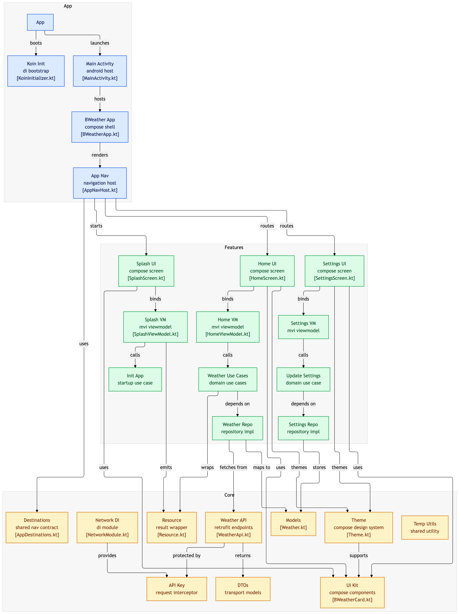
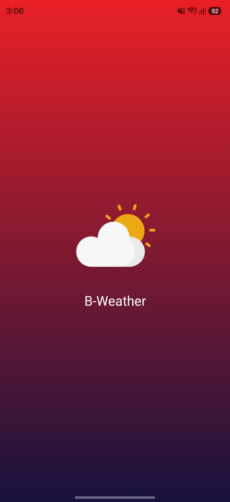
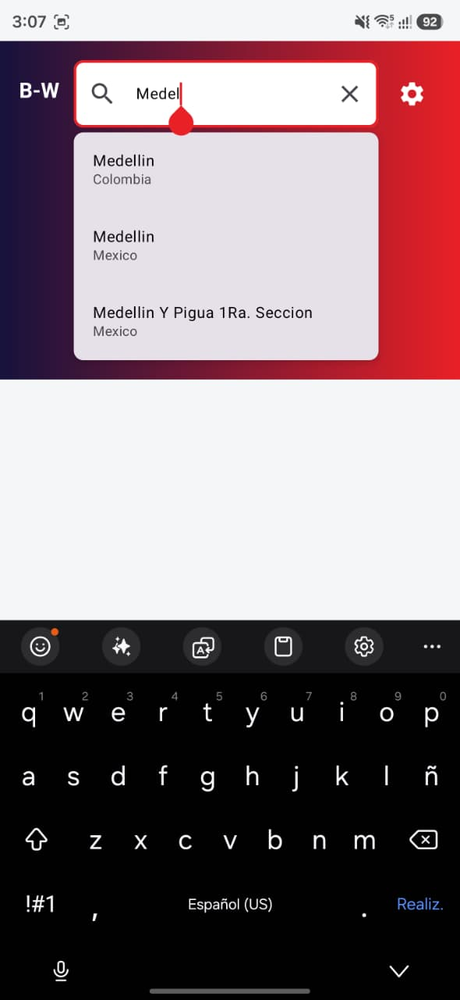
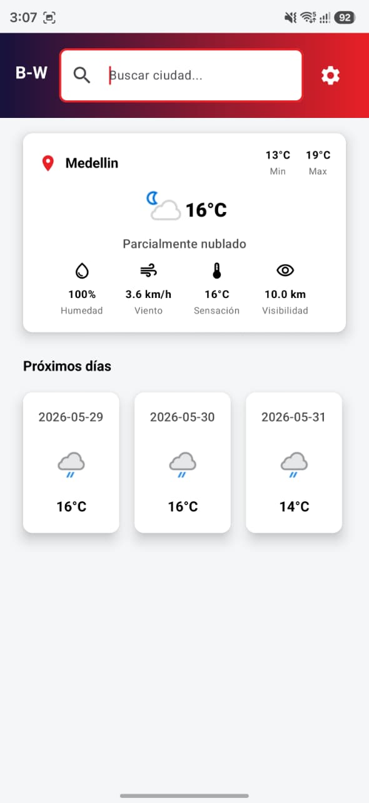
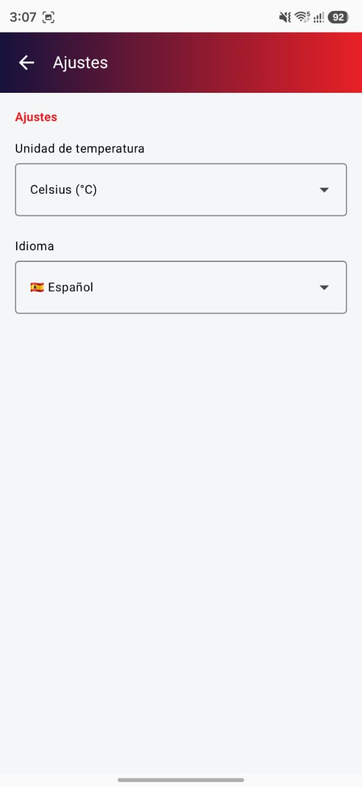

# B-Weather App 🌤️

Aplicación de búsqueda del clima y pronóstico utilizando la API de WeatherAPI (https://www.weatherapi.com/)

---

## Descripción

Esta aplicación permite a los usuarios buscar ubicaciones, visualizar el clima actual y explorar el pronóstico para los próximos días. Utiliza la API pública de WeatherAPI y está desarrollada siguiendo las mejores prácticas del desarrollo moderno en Android: **Clean Architecture**, **MVI (Model-View-Intent)**, **Jetpack Compose** y **Corrutinas**.

### Estructura

La aplicación está organizada y fuertemente modularizada en las siguientes capas principales:

* **Presentación**: Esta capa es responsable de la interfaz de usuario (construida 100% con Jetpack Compose) y del manejo del estado.
* **Dominio**: Esta capa es responsable de la lógica de negocio y las reglas de la aplicación.
* **Data (Infraestructura)**: Esta capa es responsable de la comunicación con fuentes externas (API REST) y el almacenamiento local.

---

## Diagrama arquitectura
Debido al enfoque de escalabilidad, el código está dividido en múltiples módulos de Gradle (`:app`, `:core`, y `:feature`), los cuales a su vez se agrupan en las siguientes capas de arquitectura.



### Presentación

La capa de presentación es responsable de la interfaz de usuario. En los módulos de *feature* (ej. `:feature:home`, `:feature:splash`, `:feature:settings`), se compone de los siguientes paquetes:

* **screen:** En este paquete se encuentran las pantallas principales hechas en Compose.
* **component:** En este paquete se agregan los componentes visuales reutilizables de cada feature.
* **state:** Contiene los contratos MVI: `State` (estado inmutable), `Intent` (acciones del usuario) y `Effect` (eventos de una sola vez).
* **viewmodel:** Contiene los ViewModels que procesan los Intents y actualizan el StateFlow.
* **navigation:** Maneja las rutas y la integración con Jetpack Navigation Compose.

> **Nota:** Existe también un módulo `:core:designsystem` que centraliza la tipografía, colores, temas y componentes visuales genéricos usados por toda la capa de presentación.

---

### Data (Infraestructura)

La capa de data es el puente entre la capa de dominio y las fuentes de datos (Red, Base de datos).

* **di:** En este paquete se encuentra la inyección de dependencias configurada a través de **Koin**.
* **api / dto:** Se encuentran los endpoints de Retrofit y los DTO's (Data Transfer Objects) devueltos por el backend (`:core:network`).
* **remote / local:** Fuentes de datos (DataSources) que abstraen el consumo de Retrofit o de la persistencia local.
* **mapper:** Mappers que se encargan de convertir los DTOs de la infraestructura a los modelos de dominio.
* **repository:** Implementaciones concretas de los contratos (interfaces) definidos en la capa de dominio.

---

### Dominio

La capa de dominio es el núcleo de la aplicación. Es completamente independiente de Android y de cualquier librería externa de infraestructura.

* **model:** En este paquete se encuentran los modelos de datos puros que representan el negocio (ej. `Weather`, `Forecast`).
* **repository:** Contiene las interfaces (contratos) de los repositorios que la capa de infraestructura deberá implementar.
* **usecase:** En este paquete se encuentran los casos de uso (`Use Cases`) que encapsulan una única y específica regla de negocio (ej. `GetCurrentWeatherUseCase`, `SearchLocationsUseCase`).

---

## Configuración y Ejecución

Para poder compilar y probar este proyecto correctamente en tu entorno local, es necesario configurar tu propia API Key de WeatherAPI. Por motivos de seguridad, las credenciales no se exponen en el repositorio.

1. Regístrate en [WeatherAPI](https://www.weatherapi.com/) y obtén una API Key gratuita.
2. En la raíz del proyecto, abre (o crea) el archivo `local.properties`.
3. Agrega la siguiente línea sustituyendo por tu clave real:
   ```properties
   WEATHER_API_KEY=aqui_tu_clave_api_weather
   ```
4. Sincroniza Gradle en Android Studio y ejecuta la aplicación.

---

## Test

Los tests de la aplicación se crearon para garantizar su calidad, arquitectura y evitar regresiones. Se utilizan diferentes tipos de pruebas:

* **Test Unitarios (Unit Tests):** Pruebas veloces aisladas. Se centran en verificar la lógica de los Casos de Uso, la lógica de los ViewModels (MVI) y el mapeo de datos.
* **Test de UI (Componentes):** Usando el enfoque moderno de Jetpack Compose, se testean las pantallas y componentes gráficos directamente en la **JVM** sin necesidad de un emulador, lo que los hace extremadamente rápidos.

Los tests se implementan utilizando las siguientes herramientas:

* **JUnit4:** Biblioteca de pruebas estándar.
* **MockK:** Framework moderno para creación de mocks nativo para Kotlin.
* **Robolectric:** Herramienta utilizada para correr las pruebas de UI de Jetpack Compose directamente en la máquina virtual de Java.
* **Turbine:** Librería especializada para testear flujos reactivos (`Flow` y `StateFlow`).

### Cobertura de los Test

Se ha utilizado el plugin **Kover** para medir la cobertura del código. Se han realizado tests en las diferentes capas logrando una alta cobertura (~85%+):

* **Presentación:** Se realizan test exhaustivos para los ViewModels (validando las transiciones de estado MVI) y tests de UI para verificar la renderización correcta de Compose.
* **Dominio:** Pruebas unitarias de todos los Use Cases.
* **Data:** Pruebas para los repositorios y Mappers verificando la manipulación de excepciones y conversiones de red.

Para ejecutar todos los tests y generar el reporte de cobertura al mismo tiempo, utiliza el siguiente comando en la terminal:
```bash
./gradlew testDebugUnitTest koverHtmlReportDebug
```

---

## Diseño de aplicación

En esta sección se muestran las capturas de pantalla del diseño de la aplicación. 

|                                         |                                            |
|-----------------------------------------|--------------------------------------------|
|  |   |
|  |  |

